# Aerial Photography
Aerial Photography is a website showcasing a portfolio of aerial images featuring stunning views of Irish nature and beauty. The site offers aerial photography services to industries such as real estate and tourism, as well as for personal use.

Site visitors can view mesmerizing images and a video of the Emerald Isle on this site. The homepage greets them with a stunning view of Sheep’s Head. On the homepage, visitors can also check what Aerial Photography offers and learn more about the business by visiting social media links in the footer. The site has two more visible pages. One of them showcases accomplished projects. Another allows getting in touch with the business via a contact form for further inquiries and questions. The site also has a hidden 'Thank You' page, which is displayed upon form submission.

The site could be of interest to anyone who loves Ireland and aerial photography, as well as local businesses looking to enhance their marketing and promotional materials with unique, high-quality content. The site aims to showcase the hidden gems of the Irish landscape and the beauty of well-known places from a new perspective to attract more customers.


## Features

- __Navigation Bar__

  - The fully responsive navigation bar is displayed on all site pages. It includes the Aerial Photography logo on the left and links to three site pages aligned to the right: Home, Projects, and Contact.
  
  - The design of the navigation bar remains consistent across all pages for flawless and seamless navigation. It allows site visitors to navigate through the site pages with ease, eliminating the need to use the back button in their browser.
  
  - The logo in the navigation bar features an image of a drone above the Aerial Photography abbreviation. The abbreviation and the image are divided by a horizontal line representing the horizon. This design of th  logo provides a clear visual hint about the site's focus on aerial photography.

  - The navigation bar has an orange background, inspired by the Irish flag's color palette, to represent the Irish theme. The Logo and Menu links are in black, creating a great contrast with the orange background. The navigation bar stands out on the site, looking like a separate section, which stands out from the rest of the page.


    ##### Mobile
    
    - On mobile devices, the menu is represented by a hamburger icon. Clicking on it the menu dropdown opens right below the header, showcasing the current page in bold and underlined to ensure smooth navigation. The menu items are displayed on an orange background taking the width of the screen and creating one block with the header.

    - The mobile navigation bar was created to be intuitive and easy to use. When a site page is selected, the menu dropdown disappears from the page. This provides a clean look on mobile without obstructing the page and ensures that the limited space of the mobile screen is used wisely. To access the menu items again, the site visitor needs to click on the menu icon.

        
    
    ##### Larger screens
    
    - On larger screens, menu items are positioned to the right. Vertical dividers are placed between menu items for a better visual presentation and allow to clearly and visually separate page links.
    - The current page is always displayed in bold and underlined to create a clear indication of the page the site visitor is currently on. 
    - On laptops and desktops underlining appears on menu items on hover to visually demonstrate the page a site visitor is about to click on.

    

- __Home Page image__

    ##### Mobile

    - On mobile, the homepage features a vertically oriented image. It showcases a high-quality, high-resolution view of Sheep's Head Peninsula from above.
    - Vertically oriented image is used to ensure a great impression on the site visitors, taking into consideration the vertical size of mobile screens and the importance of demonstrating stunning imagery. 
    - The overlaying text is positioned at the top of the image and is in black with white shadow and a semi-transparent background to ensure strong contact with the blue color of the sky. 
    - The site name is written in the artistic "Architects Daughter" front reflecting creativity and freedom and providing engagement. The tagline is written in clear and structured "Antic Slab" font and allows to communicate a powerful message. 


    

    ##### Larger screens
    
    - The above fold image on the home page on larger screens showcases a breathtaking view of the same Sheep’s Head Peninsula but in panoramic format. It quickly grabs the attention of site visitors. The image is of high quality and resolution to give a positive impression to the site visitors on the quality of images and the perspective of the photographs Aerial Photography can offer. 

  - The overlaying text on the larder screen is in white. It is positioned in the bottom left corner ensuring great contrast with the dark blue waters and wisely positioned not to obstruct the view of the rocky shore.


    

- __Business Info__
  
    The business information on the homepage is divided into three parts.
    
    - Business Info. Part 1.
  
        The first part includes a welcome message and brief information about Aerial Photography and its experience. Each section has a heading, and animated icons are used to draw attention to the information.
    
    ##### Mobile
    
    - On mobile, all three sections are stacked vertically to effectively use the screen pace on mobile.

        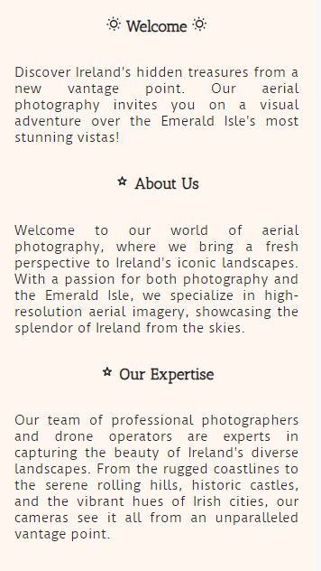
        
    ##### Larger Screens
    
    - On larger screens, the sections are also positioned vertically, they adapt to screen size, stretching across the screen width.

        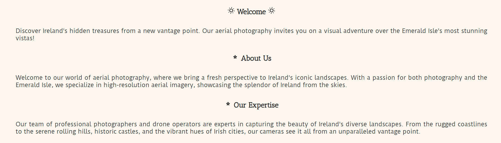
        
  - Business Info. Part 2. Quote and image.
  
    The second part the business information consists a quote by W.B. Yeats about Irish nature and a picture of Kinsale Harbor. This allos to add creativity and create a pleasant visual break in the page content.
    
    ##### Mobile
    
    - On mobile, a vertical image of boats in Kinsale Harbor is displayed.

        

    ##### Larger Screens
    
    - On larger screens, a different image is used to make full use of the screen size. A panoramic view of Kinsale Harbor is displayed to showcase the potential of the aerial photography services offered.
        
        

  - Business Info. Part 3.

    - The third part of the business information provides further information on the business, providing details on services offered, the company's promise, and reasons to choose Aerial Photography.
    
    ##### Mobile

    - On mobile, this section is presented in a vertical format.
        
    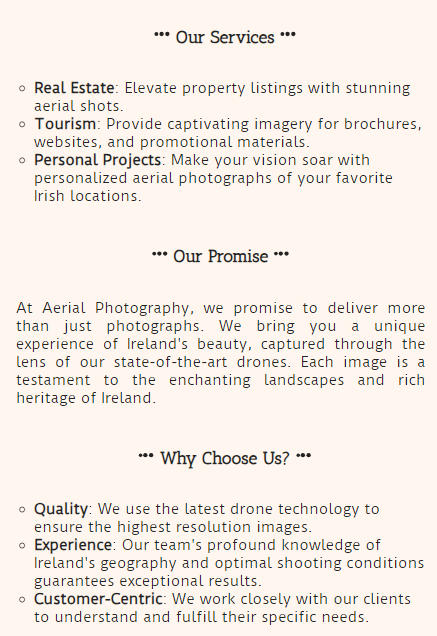

    ##### Tablet
        
    - On the tablets in becomes responsive, and adapts to the screen size forming two columns on top and one at the bottom.
        
    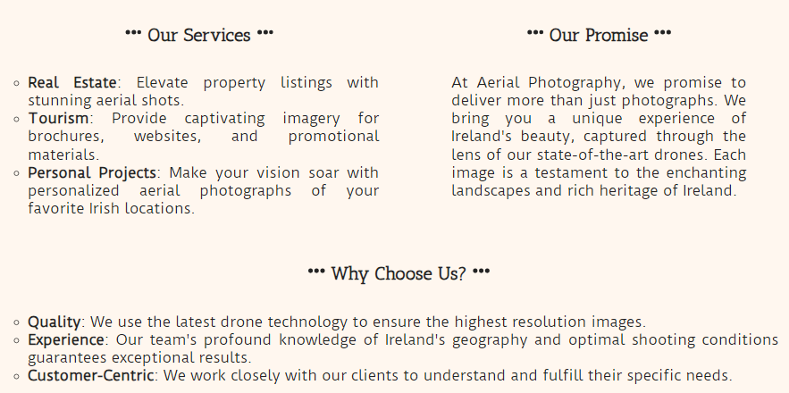

    ##### Desktop
        
    - On desktop devices the section adapts further and forms three columns, effectively using screen space.

    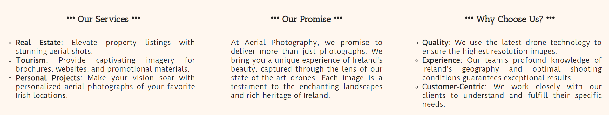

- __Footer__
  
    - The site’s footer is positioned at the bottom of the page and appears across all site pages. 
    - The color of the footer was inspired by the Irish flag theme and is in green.
    - Social media links are presented in the footer and when clicked, they take site visitors to Instagram, YouTube, or Facebook pages respectively in a new browser tab.
    - Social media links in the footer encourage site visitors to click on them and subscribe to the Aerial Photography social media channels to stay in touch and get updates on the new content released.

    

- __Projects Page__
  
    - This page showcases accomplished projects and demonstrates six high-quality, high-resolution aerial images taken in various locations in Ireland, demonstrating the great quality and unique perspective of the photographer.
  
    ##### Mobile
    
    - On mobile, images are vertically oriented to fully utilize screen width, which allows to demonstrate the quality and beauty of the images.
  
    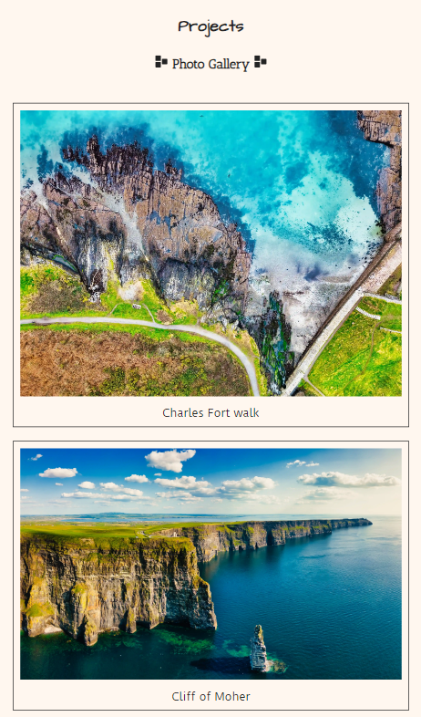

    ##### Larger Screens
    
    - On larger screens, images are displayed in two columns.

    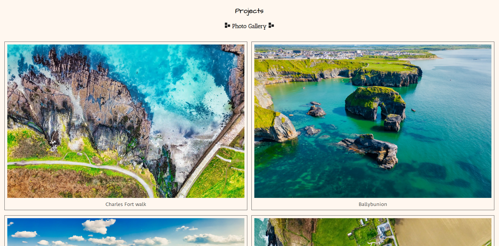
  
- __Contact Page__

  - The Contact page offers an opportunity to get in touch with the business for inquiries and additional questions. It includes a contact form with a full validation and an image of Barley Cove beach, which adapts its width to the size of the screen.

    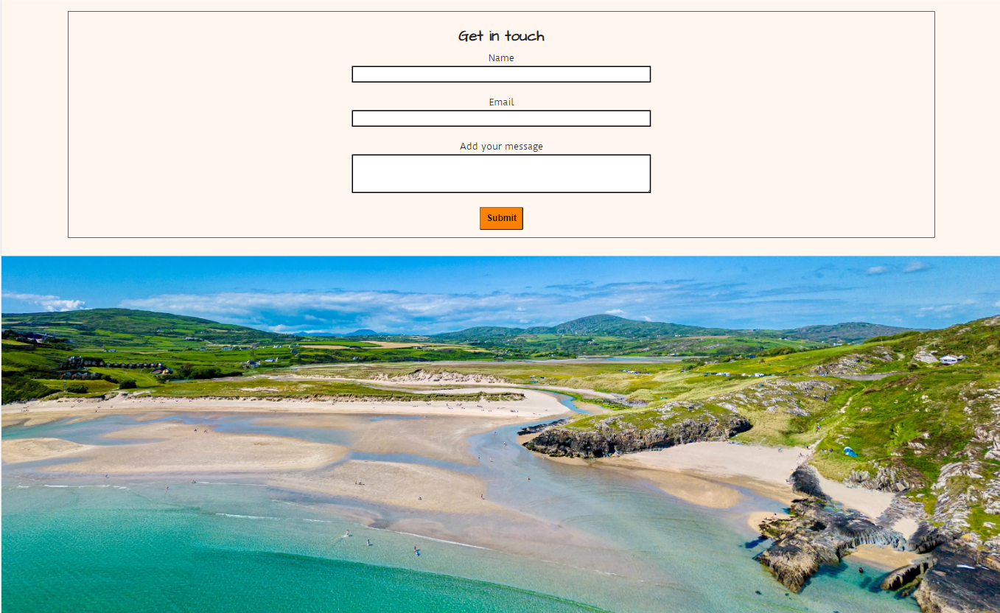

- __Thank you Page__
  
  - Upon submitting the contact form, site visitors are taken to the 'Thank You' page. On the page they are presented with a message, thanking them for the submission, as well as a video of an aerial view of Charles Fort in Kinsale which is set to autoplay. The sound on the video is automatically disabled and can be manually enabled by the site visitor.

    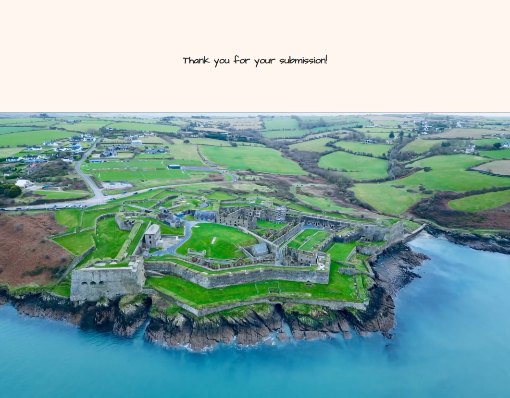

### Features Left to Implement

  - It would be beneficial to further improve the code on the 'Thank You' pafe for larger screens, to ensure that the video fits within the page in such a way that there is no vertical scrolling. This could allow the site visitors to have an easy access to the control panel of the video without the need to scroll down the page to reach the controls.
  
    #### Potential features to be implmnnted to further develop the project
    
  - It could be beneficial to develop a content management system and add login bar for member's area. This feature would enable business owners and photographers to log into the site and upload fresh content on the new and existing projects section directly without the need to go to the back end of the site and edit it.
  

## Testing

  - The site was tested in various browsers: Chrome, Microsoft Edge, Firefox, and Brave, and no issues were identified with loading the site or browsing through the site pages.
  
  - The project appears responsive and presentable, it performs full functionality on all standard screen sizes using the DevTools device toolbar and when tested through such tools as [BrowserStack Responsive Design Testing](www.browserstack.com/) and [Website Planet Responsive Checker](https://www.websiteplanet.com/webtools/responsive-checker/).
  
  - Upon physically checking the site on multiple devices one issue was identified. When the project is viewed on a 13-inch screen in a browser with a bookmarks bar present, the content is pushed down and the tagline is not readable. This means that a new media query needs to be created to shift the hero text up.

  - 13-inch screen in Microsoft browser withithout bookmarks bar
  
    

- 13-inch screen in Chrome browser with bookmarks bar present
  
    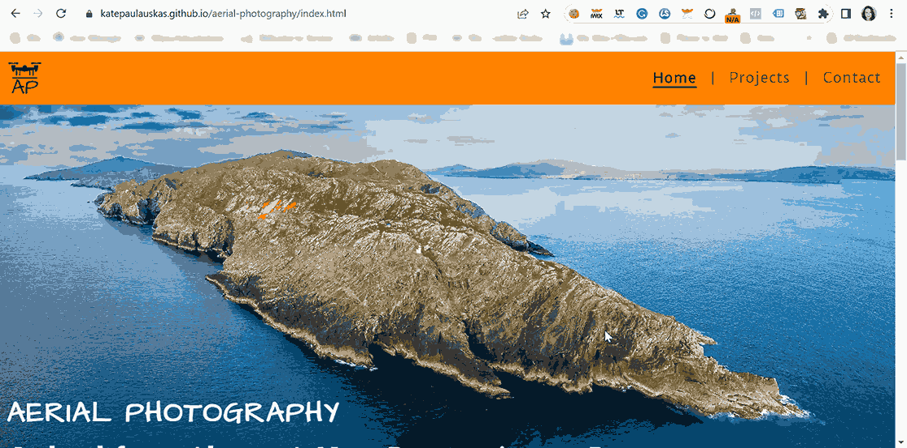

- Navigation bar and menu items are intuitive and easy to use and understand.

- The contact form is fully functional with every field requiring entries, including the email field only accepting email. The submit button is fully functional.

    ### Testing site features and behaviour

    | Action/Feature          | Expected behavior       | Status         |
    |-------------------|-------------------------|----------------|
    |Enter site URL: <https://katepaulauskas.github.io/aerial-photography/> | Home page loads | Pass |
    |Menu |
    |Click on Projects page link | Projects page loads | Pass |
    |Click on Contact page link | Contact page loads | Pass |
    |Click on Home page link | Home page loads | Pass |
    |Click on the hamburger menu icon on the mobile site | Menu items expand below the header in a dropdown | Pass |
    |Hamburger menu icon on tablets and larger screens | Hidden | Pass |
    |Form |
    |Click submit | Please fill out this field appears in the 'Name' field | Pass |
    |Fill out only the name, click submit | Please fill out this field appears in the 'Email' field | Pass |
    |Fill out name and email fields without @ sign, click submit | Please include an @ in the email address appears in the 'Email' field | Pass |
    |Fill out name and email address with @ sign, click submit | Please fill out this field appears in the 'Add your message' field | Pass |
    |Fill out name, email address with @ sign and add message, click submit | Sive visitor is taken to the 'Thank you' page | Pass |
    |Thank you page displayed upon successful submission of the form with 'Thank You' message and a video | Video plays automatically with muted sound | Pass |
    |Footer|
    |Click on Instagram icon in the footer | External link leading to Instagram opens in a new page | Pass |
    Click on YouTube icon in the footer | External link leading to YouTube opens in a new page | Pass |
    Click on Facebook icon in the footer | External link leading to Facebook opens in a new page | Pass |

### Validator Testing

- HTML

    In an attempt to adhere to web standards and accessibility, each page of the site was submitted to [W3C validation testing](<https://validator.w3.org/nu/?showsource=yes&doc=https%3A%2F%2Fkatepaulauskas.github.io%2Faerial-photography%2F>). Below is a summary of the issues identified and corresponding corrections made:

    - __Home Page__
  
      - __Issue 1:__ Trailing slash on void elements has no effect and interacts badly with unquoted attribute values.
                ```
                            <input type="checkbox" id="menu-toggle" />
                ```
      - Correction: Trailing slash and extra space were removed:
                ```
                    <input type="checkbox" id="menu-toggle">
                ```

      - __Issue 2:__ Error: Stray end tag 'iconify-icon'.
                ```
                            <h3>(...)</iconify-icon></iconify-icon></h3>
                ```

      - Correction: extra closing tag for the icon at the end of Welcome heading was removed:
                ```
                    <h3>(...)</iconify-icon></h3>
                ```

      - __Issue 3:__ Duplicate ID 'services'.
  
        ```
            <div id="services">(...)
                <ul id="services">(...)</ul>
            </div>
        ```

    - Correction: ID for unordered list was changed from
                ```
                    <ul id="services">
                ```
                                            
        to 
                ```
                    <ul id="services-list">
                ```
            . CSS file was changed accordingly.
                    
      - __Issue 4:__ The first occurrence of ID 'services' was here.
                ```
                    <div id="services">
                ```

      - Correction: Since in the Issue 3 the 
                ```
                    <ul id="services ">
                ```
            was changed to 
                ```
                    <ul id="services-list">
                ```
            the Issue 4 got resolved.

      - __Issue 5:__ Duplicate ID 'why-choose-us'.
  
        ```
        <div id="why-choose-us">(...)
            <ul id="why-choose-us">(...)</ul>
        </div>
        ```

      - Correction: ID for unordered list was changed from 
                ```
                    <ul id="why-choose-us">
                ```
            to 
                ```
                    <ul id="why-choose-us -list">
                ```
            . CSS was changed accordingly.
            
      - __Issue 6:__ The first occurrence of ID 'why-choose-us' was here.
                ```
                    <div id="why-choose-us">
                ```
      - Correction: Since in the Issue 5 the
                ```
                    <ul id="why-choose-us">
                ```
            was changed to
                ```
                    <ul id="why-choose-us-list">
                ```
            the Issue 6 got resolved.
            
      - __Issue 7__ Possible misuse of 'aria-label'.
                ```
                    <div id="kinsale-image-section" aria-label="An aerial view of Kinsale">
                ```
                    
      - Correction: Replace the 'div' element with 'section' to ensure proper use of aria-label for accessability purpose.
                ```
                    <section id="kinsale-image-section" aria-label="An aerial view of Kinsale">
                ```
    
      - Post-corrections, the code for the Home page succesfully passed W3C validation.
        
        

    - __Projects Page__
  
        When passign the Projects page HTML code through W3C validator, no errors were returned.
        

    - __Contact Page__

        - __Issue:__ Section lacks heading. Consider using 'h2-h6' elements to add identifying headings to all sections, or else use a 'div' element instead for any cases where no heading is needed.
                ```
                    <section id="get-in-touch-img" aria-label="Aerial view of Barley Cove in Ireland">
                ```

        - Correction: Hidden heading was added to the image section:
  
            ```
                <section id="get-in-touch-img" aria-label="Aerial view of Barley Cove in Ireland">
                <h2 class="hidden-heading">Aerial view of Barley Cove in Ireland</h2>
            ```

      - The code for the Contact page succesfully passed W3C validation after the introduced correction.
        
                    
    - __Thank You page__
        - __Issue 1:__ The 'frameborder' attribute on the 'iframe' element is obsolete. Use CSS instead.

             ```
                <iframe src=https://www.youtube-nocookie.com/embed/lySMfmgim5M?si=l4s54nbUCoQdlkJ5&autoplay=1&mute=1&loop=1&playlist=lySMfmgim5M&vq=hd1080&rel=0
                (…) frameborder="0" >
                (…)
                </iframe>
            ```

        - Correction: The 'frameborder' attribute was removed from HTML and added in CSS
                    ```
                        #video iframe {
                        (…)
                            border: 0;
                        }
                    ```

        - __Issue 2:__ Section lacks heading. Consider using 'h2-h6' elements to add identifying headings to all sections, or else use a 'div' element instead for any cases where no heading is needed.
                    ```
                        <section id="video">
                    ```

        - Correction: Hidden heading was added to the video section:
            ```
            <section id="video">
            <h2 id=”hidden-heading”>Aerial view of Charles Fort </h2>
            (…)
            </section>
            ```

      - Post-corrections, the code for the Thank You page succesfully passed W3C validation.


- __CSS__
  
    To align with web standards and ensure accessability compliance CSS code of the site was submitted to [(Jigsaw) validator](https://jigsaw.w3.org/css-validator/validator?uri=https%3A%2F%2Fkatepaulauskas.github.io%2Faerial-photography%2F&profile=css3svg&usermedium=all&warning=1&vextwarning=&lang=en). Below is a summary of the issues identified and corresponding corrections made:

  - __Issue 1:__ 64 - header - 'top' is not a 'align-items' value : 'top'
    - Correction: 'top' was replaced with 'flex-start' value to 'align-items' to the top using instructions from [W3Schools](https://www.w3schools.com/cssref/css3_pr_align-items.php).

  - __Issue 2:__ 227 - #services-list, #why-choose-us-list - Value Error : font-family 100% is not a font-family value : 100%
    - Correction: 'font-family' was replaced with 'font-size'

  - __Issue 3:__ 438 - #hero-section - left is not a align-items value : left
    - Correction: To align items to the left 'align-items' property was replaced with 'justify content' property and 'flex-start' value was used to keep items to the left" using instructions from [W3Schools](https://www.w3schools.com/cssref/css3_pr_justify-content.php).

  - __Issue 4:__ Warning - Imported style sheets are not checked in direct input and file upload modes:
  
    ```
        @import url('https://fonts.googleapis.com/css2?family=Antic+Slab&family=Architects+Daughter&family=Duru+Sans&display=swap') ;
    ```

    - Comment: This is an external stylesheet provided by Google fonts and it is beyond our control to check it


- __Accessability__

    To ensure the accessibility requirements are met for the current project, the Lighthouse testing was done for mobile and desktop versions of the site.

  - Mobile

    - Initially, the test did not return high results for site performance on mobile, providing a score of 56. Whereas accessibility results were 100, which ensures that the fonts and colors chosen for this project are easy to read.
  
    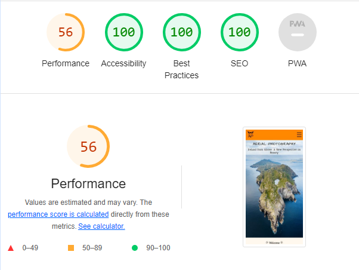

    - After resizing the hero image and logo on mobile, as well as converting the logo file to WebP format, the performance indicator was significantly improved.

    

    - Desktop

    - The Lighthouse test returned great results for the desktop version of the site, confirming that the site is fully accessible, has great performance and SEO settings, and uses best practices.

    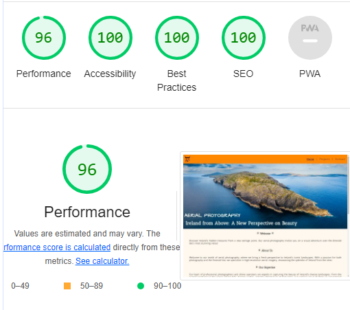
    
    ##### Site Colors Accessibility
    
    Site colors were checked for accessibility to ensure they are color-blind safe using the [Adoby Color accessinility tool](https://color.adobe.com/create/color-accessibility):
    
    

    Additionally, site text and icon colors were tested against their backgrounds for contrast using the [Adoby Color Contrast Checker](https://color.adobe.com/create/color-contrast-analyzer).
    
      - Header: 
    
        
      - Page body:
    

      - Footer:
  
        White on green is only used for graphic components in the footer, such as social media icons, therefore there are no issues with this color combination:
    

        
        
    
  
### Solved Bugs

- Menu dropdown on mobile
  - It was noticed that there is a gap appearing between the navigation bar and the dropdown menu on mobile. This was because the header did not have a bottom border set:

    ```
    header {
    background-color: #FF8200;
    padding: 0 0;
    position: fixed;
    z-index: 99;
    width: 100%;
    display: flex;
    justify-content: space-between;
    align-items: top;
    padding-right: 0px;
    height: 75.4px;
    margin: 0;
    }
    ```
    
    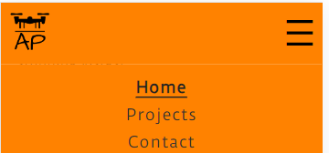

  - In an attempt to fix this issue, a bottom border matching the color of the navigation bar was added, but a small gap still remained:
                ```
                    border-bottom: 2px solid #FF8200;
                ```
    
    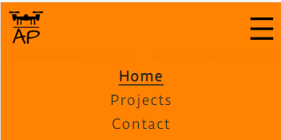
  
  - In order to test the issue the color of the bottom border was changed to black, and the gap completely disappeared:
                ```
                    border-bottom: 2px solid #000000;
                ```
    
    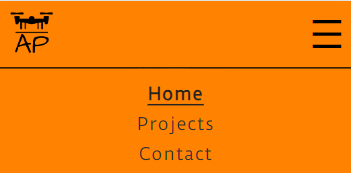
  
  - It was decided to change the bottom border color to dark-orange instead of the orange of the navigation bar, since the gap persisted with the orange color. The dark-orange color, in contrast to black, maintains the clean and aesthetically pleasing look of the navigation bar. Once the color was changed to dark-orange, the issue with the gap no longer persisted:
                ```
                border-bottom: 2px solid #E67500;
                ```

    

### Shortcomings

- Form Submission

    To keep the consistent look and style of the site as well as exceptional user experience, it was decided not to send form submissions to the external link of the Code Institute. Instead, it was decided to direct site visitors to a hidden page on the site to ensure the site visitors stay on the site and are not directed to an external link. In an attempt to display form submission using instructions from [W3Schools](<https://www.w3schools.com/php/php_forms.asp>) the following files were created: process-form.php and display-results.php and appropriate code was used. However, later on, it was discovered, that backend is not available on this project. Therefore, the created files were deleted and replaced with the ‘Thank You’ page, which includes a thank you message, without a presentation of the results submitted.

- Image preload

    Although site performance has a high score on desktop, it was noticed that the hero image might sometimes take a second to load and home page appears blank. To resolve this, ideally, a blurred image should be loaded immediately. However, since only HTML and CSS are used for this project, implementing such a feature with a blurred image would not be possible. To ensure that the overlaying text on the image is readable and does not blends with the page background when image loads, and to avoid an impression that the page is empty, a background color was added to the hero section. The color was picked form the hero image and partially imitated the blurred effect of the image.

    

## Deployment

The live link to the site can be found at the following URL: [Aerial Photography]

## Credits

### Content
  - The text for the home page was generated using [Chat GPT](https://chat.openai.com/)
  - To select the fonts for the site, font pairing service was used: [Font Joy](https://fontjoy.com/)
  - Paired fonts families were downloaded from [Google Fonts](https://fonts.google.com/)
  - Site colors were checked with the accessinility tool 
  - Icons displayed in the footer and animated icons displayed on the Home and Projects pages were taken from [Iconify](https://iconify.design)
  - Irish flag color codes were taken from [FlagColorCodes.com](https://www.flagcolorcodes.com/ireland)
  - 

### Media

    Personal media and video files were used to build the current project.

