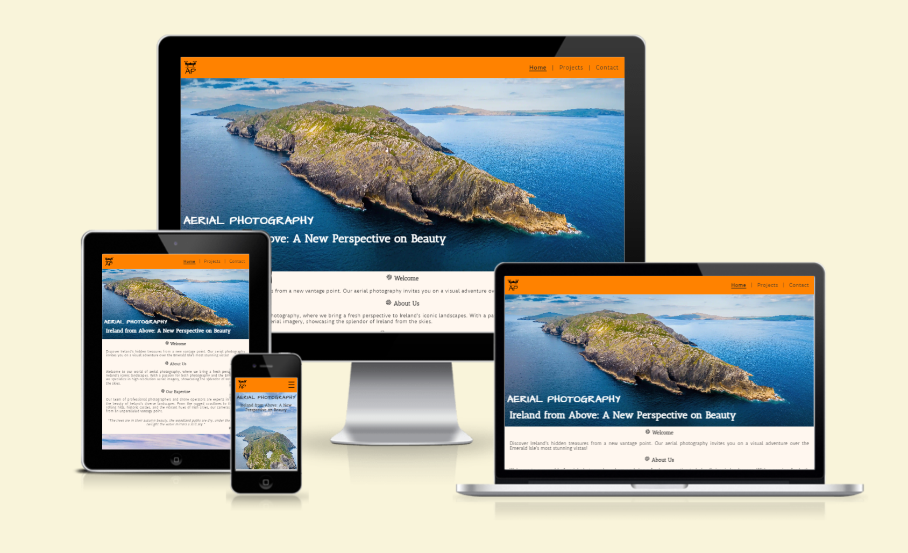
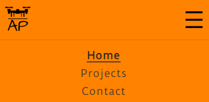
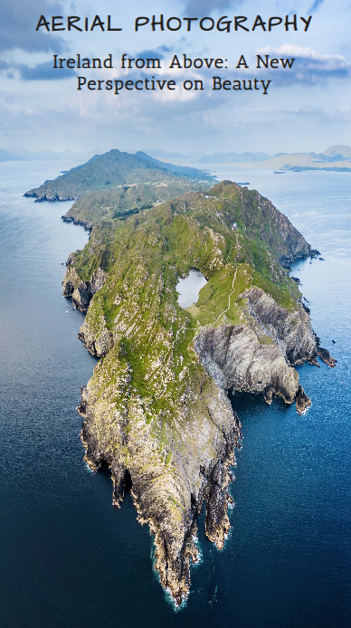
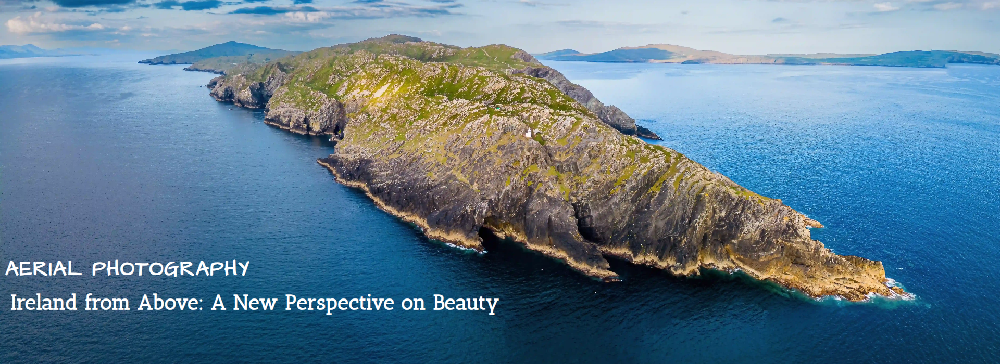

# Aerial Photography
Aerial Photography Aerial Photography is a website that presents a collection of aerial images showcasing Ireland's picturesque vistas. It is dedicated to providing aerial photography services tailored to a variety of sectors, including real estate and tourism, as well as for personal projects.

Visitors to the site are greeted with a captivating image of Ireland that beautifully captures the essence of the Emerald Isle. The website offers information about Aerial Photography and provides insights into the business and services offered. Additionally, users can explore Aerial Photography's social media profiles for more stunning visuals and get in touch with the team for specific inquiries or service requests.

This site is designed for anyone with a passion for Ireland and aerial photography. It is particularly beneficial for businesses in Ireland seeking to enhance their marketing and promotional content with unique and eye-catching imagery or videos. The primary goal of the website is to showcase the beauty of the Irish landscape from an elevated perspective, including hidden gems and offering viewers a fresh look at familiar scenes.



## Features

- __Navigation Bar__

  - Fully responsive and prominently positioned at the top of all site pages, the navigation bar is an essential feature of the site. It neatly presents the Aerial Photography logo on the left, with links to the three main site pages - Home, Projects, and Contact - aligned on the right.
  
  - The navigation bar maintains a consistent design across all pages, facilitating effortless navigation for users throughout the site. The logo, representing Aerial Photography, features a drone image above its abbreviation, divided by a horizontal line that evokes the horizon. This design effectively hints at the site's focus on aerial photography.
  
  - The navigation bar is distinguished by its orange background which was inspired by the Irish flag color palette, to reflect the Irish theme of the site. The black text of the logo and menu icon on mobile as well as links on desktop create a striking contrast against the orange backdrop, making the navigation bar visually prominent. This design choice enhances the aesthetic appeal and clearly separates the navigation bar from the rest of the content on the site pages.

  - The navigation bar enables visitors to easily move through the site without the need to use the back button in their browser. Its intuitive layout and eye-catching design ensure that users can navigate the site with ease and efficiency.


    ##### Mobile
    - On mobile devices, a hamburger icon serves as the menu representation. When clicked, the menu items expand below the header, highlighting the current page in bold and underlined ensuring easy navigation. The menu items are displayed against an orange background, matching with the header's color and extend across the width of the screen forming cohesive block with the header.

    - Once a page is selected, the menu items retract, allowing full access to the page content. The menu items can be accessed again at any time through the menu hamburger icon. This design optimizes the limited space available on mobile devices while preserving a clear and intuitive user experience.

    
    
    ##### Larger screens
    - Vertical dividers between the menu items on tablets and larger screens enhance visual presentation and distinctly separate each page link.
    - The current page is alway in bold and underlined to cleate clear impression of page the site visotor is currently on.
    - On laptops and desktops, underlining appears on menu items on hover to visually deomstrate the page a site visitor is about to click on.
  
    

- __Home Page image__

    ##### Mobile

    - On mobile devices, the homepage's image is vertically oriented, featuring a stunning view of the rocky shores of Sheep's Head Peninsula from above, presented in hight quality and resolution.
  
    - This arrangement ensures a captivating impression on mobile visitors, taking into consideration the vertical size of the screens and the importance of showcasing stunning imagery Aerial Photography is able to offer.
  
    - The overlaid text is positioned at the top of the image, displayed in black with a white shadow and a semi-transparent background to create excellent contrast with the blue sky, ensuring optimal readability and aesthetic appeal.

    - The site name is presented in the "Architects Daughter" font, characterised by its handcrafted and distinctive style, reflecting creativity and freedom. In contrast, the tagline is set in "Antic Slab," a font with a structured and robust appearance, effectively conveying a powerful and engaging message.

    

    ##### Larger screens
    
    - On larger screens, a breathtaking view of the rugged shores of Sheep's Head Peninsula in Ireland is presented from a different perspective in a panoramic format. It serves as the homepage's above-the-fold image with the purpose of immediately capturing the attention of site visitors. This high-quality, high-resolution image, optimized for larger screens, provides visitors with an introduction to the quality of imagery offered, showcasing the unique perspective that Aerial Photography delivers.

    - The overlay text is displayed in white, strategically positioned in the bottom left corner to ensure a striking contrast with the deep blue waters and thoughtfully placed so as not to obstruct the view of the rocky shoreline.

    

   

- __Business Info__

- __Footer__

- __Projects Page__

- __Contact Page__

- __Thank you Page__

### Features Left to Implement

## Testing

### Validator Testing

- __HTML__

    In an attempt to adhere to web standards and accessibility, each page of the site was passed through [W3C validation testing](<https://validator.w3.org/nu/?showsource=yes&doc=https%3A%2F%2Fkatepaulauskas.github.io%2Faerial-photography%2F>). Below is a summary of the issues identified and corresponding corrections made:

    - Home Page
  
      - Issue 1: Trailing slash on void elements has no effect and interacts badly with unquoted attribute values.
            ```
                        <input type="checkbox" id="menu-toggle" />
            ```
        - Correction: Trailing slash and extra space were removed:
                ```
                    <input type="checkbox" id="menu-toggle">
                ```

      - Issue 2: Error: Stray end tag iconify-icon.
                ```
                            <h3>(...)</iconify-icon></iconify-icon></h3>
                ```

    	- Correction: extra closing tag for the icon at the end of Welcome heading was removed:
                ```
                    <h3>(...)</iconify-icon></h3>
                ```

      - Issue 3: Duplicate ID services.
                ```
                    <div id="services">(...)
                        <ul id="services">(...)
                        </ul>
                    </div>
                ```

          - Correction: ID for unordered list was changed from 
                    ```
                        <ul id="services ">
                    ```
            to 
                    ```
                        <ul id="services-list">
                    ```
            . CSS file was changed accordingly.
                    
      - Issue 4. The first occurrence of ID services  was here.
                ```
                    <div id="services">
                ```

          - Correction: Since in the Issue 3 the 
                    ```
                        <ul id="services ">
                    ```
            was changed to 
                    ```
                        <ul id="services-list">
                    ```
            the Issue 4 got resolved.

      - Issue 5. Duplicate ID why-choose-us.
                ```
                    <div id="why-choose-us">(...)
                        <ul id="why-choose-us">(...)
                        </ul>
                    </div>
                ```

          - Correction: ID for unordered list was changed from 
                    ```
                        <ul id=" why-choose-us">
                    ```
            to 
                    ```
                        <ul id=" why-choose-us -list">
                    ```
            . CSS was changed accordingly.

- __CSS__

- __Accessability__

### Unfixed Bugs

## Deployment

The live link to the site can be found at the following URL: [Aerial Photography]

## Credits

### Content

### Media


