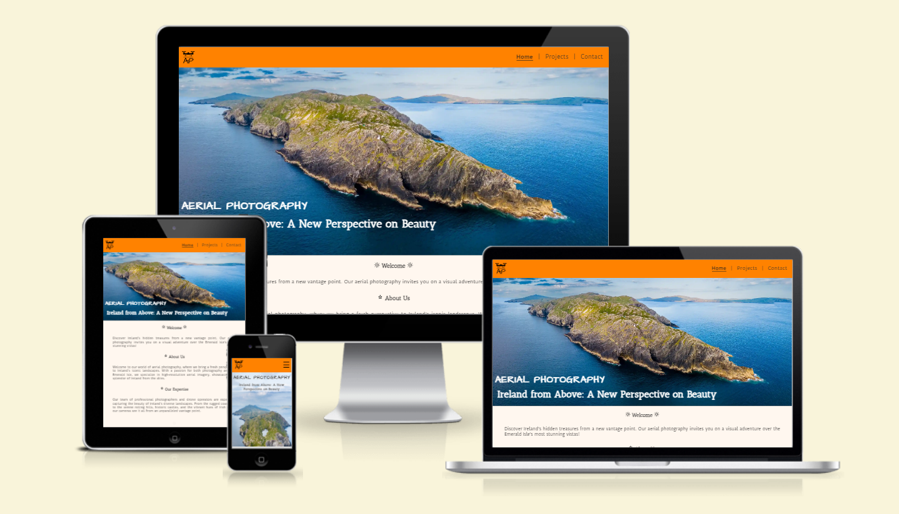

# Aerial Photography
Aerial Photography Aerial Photography is a website that presents a collection of aerial images showcasing Ireland's picturesque vistas. It is dedicated to providing aerial photography services tailored to a variety of sectors, including real estate and tourism, as well as for personal projects.

Visitors to the site are greeted with a captivating image of Ireland that beautifully captures the essence of the Emerald Isle. The website offers information about Aerial Photography and provides insights into the business and services offered. Additionally, users can explore Aerial Photography's social media profiles for more stunning visuals and get in touch with the team for specific inquiries or service requests.

This site is designed for anyone with a passion for Ireland and aerial photography. It is particularly beneficial for businesses in Ireland seeking to enhance their marketing and promotional content with unique and eye-catching imagery or videos. The primary goal of the website is to showcase the beauty of the Irish landscape from an elevated perspective, including hidden gems and offering viewers a fresh look at familiar scenes.

## Features

- __Navigation Bar__
  
    ##### Desktop

  - Fully responsive and prominently positioned at the top of all site pages, the navigation bar is an essential feature of the site. It neatly presents the Aerial Photography logo on the left, with links to the three main site pages - Home, Projects, and Contact - aligned on the right.
  
  - The navigation bar maintains a consistent design across all pages, facilitating effortless navigation for users throughout the site. The logo, representing Aerial Photography, features a drone image above its abbreviation, divided by a horizontal line that evokes the horizon. This design effectively hints at the site's focus on aerial photography.
  
  - The navigation bar is distinguished by its orange background which was inspired by the Irish flag color palette, to reflect the Irish theme of the site. The black text of the logo and menu links create a striking contrast against the orange backdrop, making the navigation bar visually prominent. This design choice enhances the aesthetic appeal and clearly separates the navigation bar from the rest of the content on the site pages.

  - Vertical dividers between the menu items enhance visual presentation and distinctly separate each page link.

  - The navigation bar enables visitors to easily move through the site without the need to use the back button in their browser. Its intuitive layout and eye-catching design ensure that users can navigate the site with ease and efficiency.

    

    ##### Mobile

    

- __Home Page image__

    ##### Desktop

    

    ##### Mobile

    

- __Business Info__

- __Footer__

- __Projects Page__

- __Contact Page__

- __Thank you Page__

### Features Left to Implement

## Testing

### Validator Testing

- __HTML__

- __CSS__

- __Accessability__

### Unfixed Bugs

## Deployment

The live link to the site can be found at the following URL: [Aerial Photography]

## Credits

### Content

### Media

